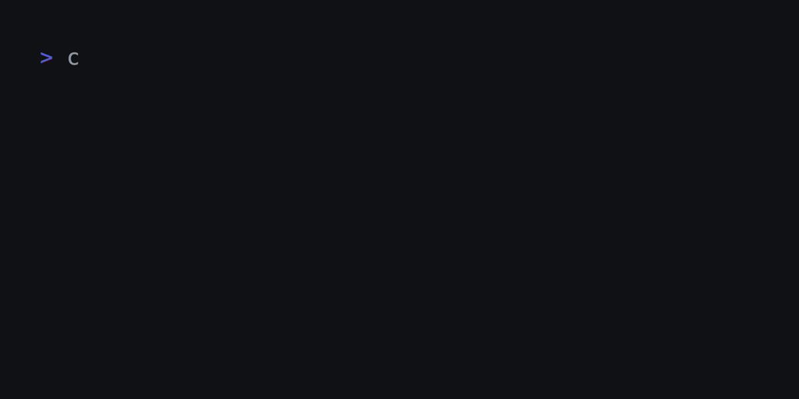

**csr** is a conceptual spaced repetition CLI built using LangChain and Click!

Unlike with normal flash cards, **csr** only requires you to name or describe what you'd like to remember, and it can evaluate synthetic, more conceptual responses.

## Installation

**pipx** makes for the easiest installation ([see **pipx** installation page](https://pipx.pypa.io/latest/installation/)):

1. Download the [v0.1.3 wheel](./dist/csr-0.1.3-py3-none-any.whl)
2. Run `pipx install csr-0.1.3-py3-none-any.whl`

## Usage

- Create a new csv file: `touch deck.csv`
- Add your first card: `csr add deck.csv "who Henri Lefebvre was"`
- Practice your deck: `csr practice deck.csv`
